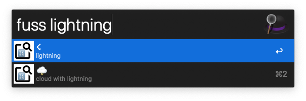
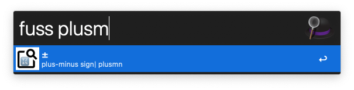
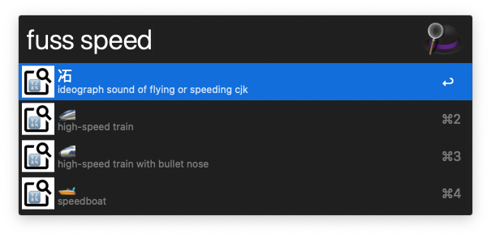

Fuss
====

Fuss is the Faster Unicode Symbol Search workflow for Alfred. It allows for the rapid search and insertion of Unicode into your frontmost app window. Useful for finding the right emoji or the right symbol in specialized applications like science or engineering.

Fuss is a reimplementation of the highly useful [Unicode Symbols Search](https://github.com/bevesce/unicode-symbols-search), but much faster. I was a heavy USS user, but it would take hundreds of milliseconds to perform a search, which is visible when Alfred runs a new search for every character you type. Fuss achieves a steady 16 ms on my Mac Mini, which humans generally perceive as instantaneous.

For example, let us write that the thickness of paper is generally 70–100 µm.


Installation
------------

Fuss is a workflow for [Alfred 4](https://www.alfredapp.com/), a powerful and extensible launcher for macOS. Install Alfred, then open the [latest fuss workflow release](<https://github.com/fotonick/faster_unicode_symbol_search/releases/latest>).

Usage
-----

When you invoke Alfred with your assigned hotkey, generally ⌥␣ (option-space), type ``fuss``, a space, then whatever you want to search for.

Examples
--------






Performance
-----------

On my late 2012 Mac Mini, I see that

```
hyperfine --export-markdown fuss_performance.md --warmup 3 "fuss capital delta" "python3 unicode_symbols_search.py capital delta"
```
produces:

| Command | Mean [ms] | Min [ms] | Max [ms] | Relative |
|:---|---:|---:|---:|---:|
| `fuss capital delta` | 16.3 ± 1.0 | 14.8 | 21.1 | 1.00 |
| `python3 unicode_symbols_search.py capital delta` | 126.5 ± 3.0 | 119.3 | 132.5 | 7.77 ± 0.52 |

Profiling via ``cargo bench`` reveals that the actual search only takes ~2 ms. By commenting pieces of the main function out, I've determined that ~3 ms is overhead, and the remaining ~11 ms is in loading the pre-parsed symbols database embedded within the executable. Supposedly, [Cap'n Proto](https://github.com/capnproto/capnproto-rust) is faster than [bincode](https://github.com/servo/bincode) for such deserialization, but I didn't feel that it was worth going any further.

Building from source
--------------------

Fuss is written in the Rust programming language. The rust toolchain can be installed via ``brew install rustup; rustup-init`` if you use Homebrew, or else from the [rustup website](https://rustup.rs/) directly. Then:

```
# one-time setup for universal builds
cargo install cargo-make
rustup target install x86_64-apple-darwin
rustup target install aarch64-apple-darwin

# build and package
cargo make package

# install
open "Faster Unicode Symbol Search.alfredworkflow"
```

To bump the version number of the Alfred workflow, edit ``info.plist`` near the bottom:

```
    <key>version</key>
    <string>0.1</string>
```

License
-------

This software is released under the MIT license.

Contribution
------------

Unless you explicitly state otherwise, any contribution intentionally submitted for inclusion into this project shall be licensed as MIT, without any additional terms or conditions.
